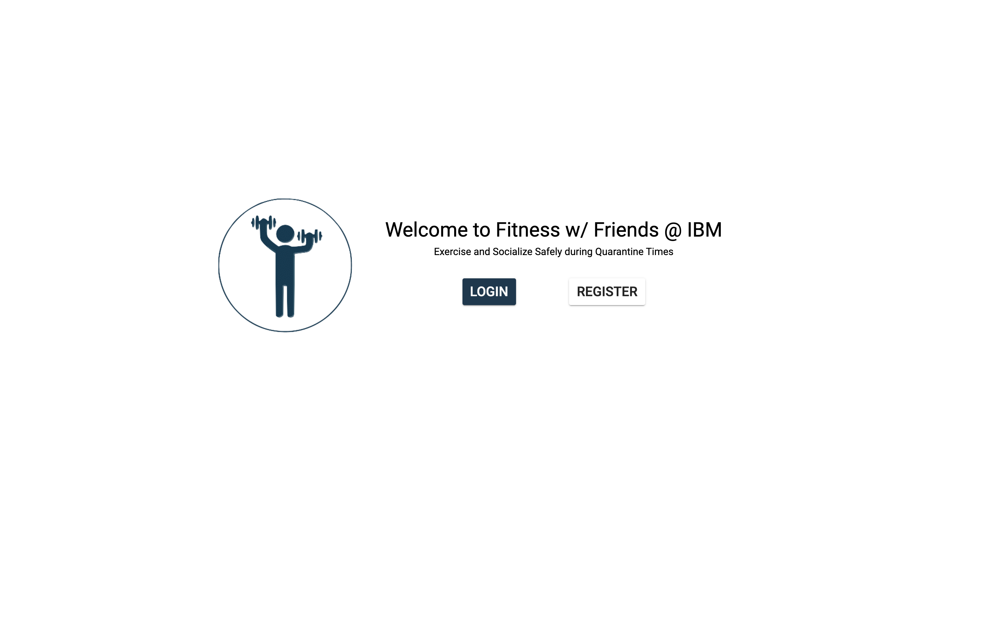
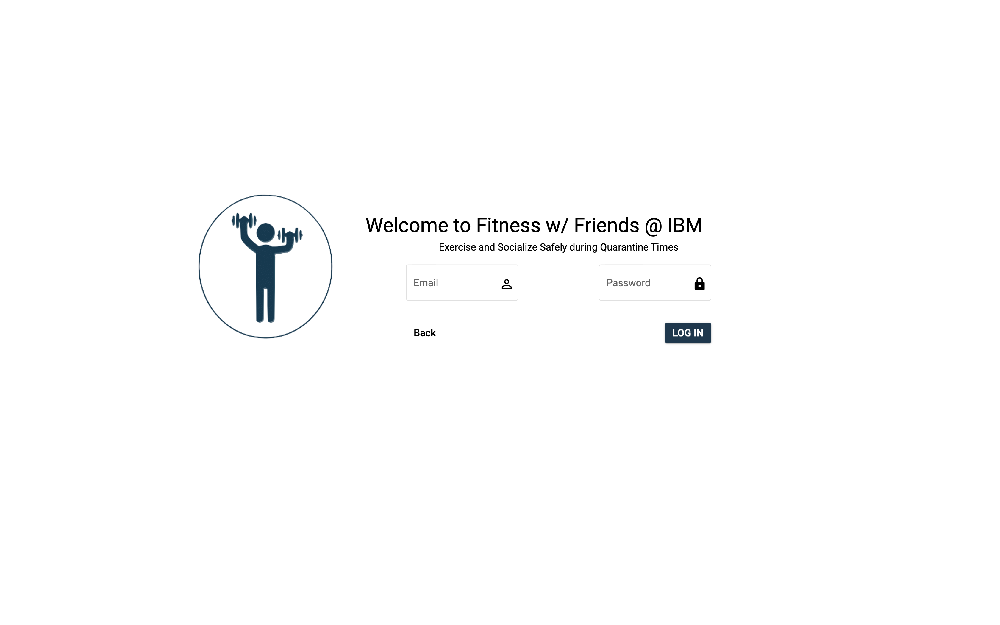
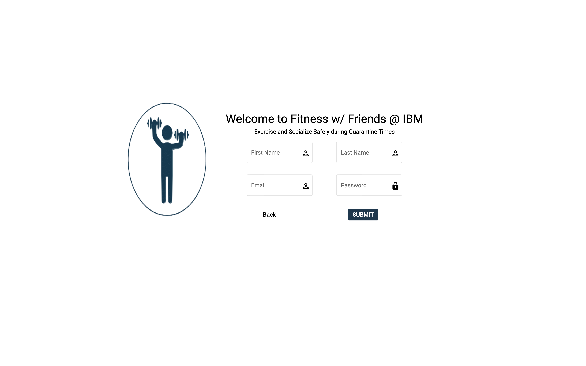

# Fitness with Friends

Fitness with Friends at IBM is a web app that currently uses Angular to run locally. Once the server is connected as per instructions below, the app will begin at startup. Afterwards you will have the option to login or register

 

After registering the user will be guided to create a group and an exercise plan.

Once the user is a part of at least 1 group and 1 plan, they will be taken to the feed page upon login, where they can post about workout and milestones, comment and like other posts, as well as join new groups or exercise plans.

To start, run `npm install`

Run `ng serve` for a dev server. Navigate to `http://localhost:4200/`. The app will automatically reload if you change any of the source files.

This project was generated with [Angular CLI](https://github.com/angular/angular-cli) version 9.1.3.
